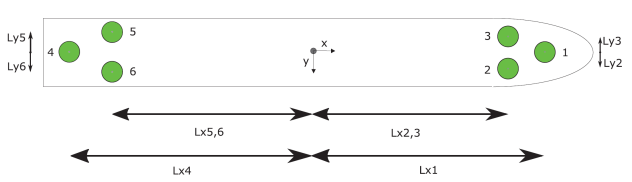

# Thrust Allocation

This folder contains code implementation realted to thrust allocation of CSAD.

Inspiration is taken from both of the following repositories. It is recommended for any user to check these out.

- https://github.com/freol35241/quta
  - Check out for inspiration for implementing a quadratically optimized thrust allocation with constraints.
- https://github.com/NTNU-MCS/CS_ArcticDrillship/tree/master/2022_MTech/Br%C3%B8rby/csad_dp-main/src/thrust_allocation
  - Check out for CSAD spesific ROS adaptable thrust allocation implementation. 

The folder contains the following files:

- `allocation.py`: Solves the allocation problem
- `constraints.py`: At the moment not in use
- `thruster.py`: Defines thrusters

## Information about CSAD

### Thruster configuration

CSAD is equipped with six azimuth thrusters which is positioned as illustrated below.

## Conventions for mapping to MC-lab

The azimuth angles &alpha; are defined as follow:
- &alpha; = 0&deg; &rarr; max positive surge thrust
- &alpha; = 90&deg; &rarr; max positive sway thrust

Note that the angles are given in radians.

All variables setting and reading the power of the motors are mapped from -1.0 to 1.0, with 1 being 100% forward and -1.0 being 100% backwards. As
the motors are much more powerful than desired for the model the thrust is halved. This means the 1 is actually just 50% of the capability of the motors. Note that there is nothing in the code stopping anyone from sending 2 and setting the motor to 100% power.
